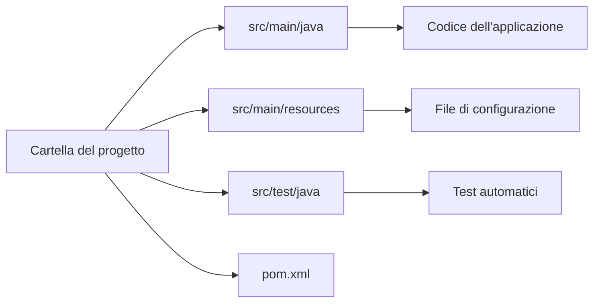
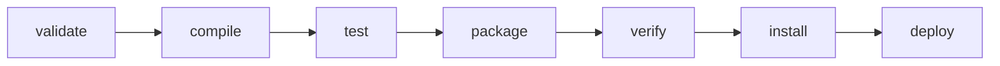
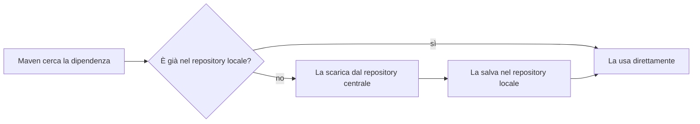
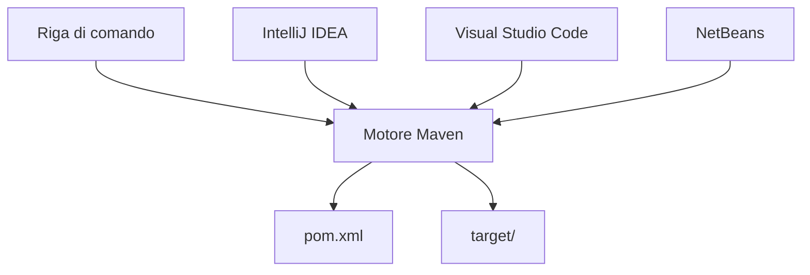

# Maven: uno strumento per costruire progetti Java

## Il problema che Maven risolve

Quando un programma Java è composto da un solo file, è sufficiente digitare `javac Main.java` per compilarlo e `java Main` per eseguirlo. Questo approccio funziona bene per esercizi molto piccoli, ma smette rapidamente di funzionare quando un progetto cresce. Un progetto reale è composto da decine o centinaia di file `.java`, che devono essere compilati nell'ordine corretto tenendo conto delle dipendenze tra classi; utilizza spesso librerie scritte da altri, che vanno reperite, scaricate nella versione giusta e rese disponibili al compilatore; deve produrre alla fine un archivio eseguibile, tipicamente un file JAR; e deve poter essere ricostruito in modo identico da chiunque, indipendentemente dal computer usato.

Gestire manualmente tutti questi aspetti diventa presto impraticabile. Per questo esistono i cosiddetti build tool, programmi che si occupano di compilare il codice, scaricare le librerie necessarie, eseguire i test automatici e produrre il file finale. Maven è uno dei build tool più diffusi nell'ecosistema Java.

## Cos'è Maven

Maven è uno strumento che legge la descrizione di un progetto da un file di configurazione e, a partire da quella descrizione, sa come compilarlo, quali librerie scaricare e come produrre il risultato finale. Questo file si chiama `pom.xml`, dove POM è l'acronimo di Project Object Model: è, appunto, la rappresentazione del progetto in forma di oggetto, con le sue proprietà, le sue dipendenze e le sue istruzioni di costruzione.

Un aspetto centrale del funzionamento di Maven è che si basa su convenzioni condivise invece che su configurazioni scritte a mano. Un progetto Maven segue sempre la stessa struttura di cartelle e Maven sa già, senza bisogno che venga specificato ogni volta, dove trovare il codice, dove metterlo dopo la compilazione e come chiamare l'archivio finale. Questo principio si chiama convention over configuration, convenzione al posto della configurazione, e verrà richiamato più volte in questa lezione perché è la chiave per capire perché Maven richieda così poche informazioni per funzionare.

## Le coordinate di un progetto: groupId, artifactId, version

Ogni progetto Maven, e ogni libreria pubblicata su un repository Maven, viene identificato da tre informazioni che insieme formano quella che si chiama comunemente la terna GAV.

Il groupId identifica l'organizzazione o l'autore del progetto, di solito scritto con la convenzione del dominio invertito, per esempio `org.example` oppure `com.google.guava`. L'artifactId è il nome specifico del progetto o della libreria, per esempio `myproject` oppure `guava`. La version indica la versione, per esempio `1.0` oppure `5.10.0`.

Questa terna non è un semplice dato descrittivo: è l'indirizzo con cui quel progetto o quella libreria viene cercato e trovato all'interno di un repository Maven. Quando più avanti in questa lezione si scaricherà una libreria reale da Internet, si vedrà che il groupId e l'artifactId corrispondono esattamente al percorso con cui quella libreria è organizzata sul sito del repository, e la version al nome della sottocartella in cui si trova quel rilascio specifico.

## La struttura standard delle directory

Un progetto Maven segue sempre lo stesso schema di cartelle:

```
progetto/
    pom.xml
    src/
        main/
            java/
            resources/
        test/
            java/
```

Il codice dell'applicazione va in `src/main/java`, eventuali file di configurazione non Java in `src/main/resources`, e il codice dei test automatici in `src/test/java`. Questa è esattamente l'applicazione pratica del principio di convenzione descritto sopra: poiché ogni progetto Maven rispetta questa struttura, Maven può sapere automaticamente dove cercare il codice senza che nessuno debba specificarlo nel pom.xml. Lo schema seguente riassume questa corrispondenza fissa tra cartella e contenuto:



## Installare Maven

Maven si scarica dal sito ufficiale, alla pagina:

Download Apache Maven: https://maven.apache.org/download.cgi

Dopo aver scompattato l'archivio, occorre aggiungere la sua cartella `bin` alla variabile d'ambiente PATH del sistema operativo. Per verificare che l'installazione sia andata a buon fine si apre un terminale e si digita:

```
mvn -version
```

Se il comando restituisce la versione di Maven installata insieme a quella di Java in uso, l'installazione è corretta e si può procedere.

## Il primo progetto da riga di comando

Il modo migliore per capire cosa fa davvero Maven è costruire un progetto minimo interamente a mano, senza usare generatori automatici né ambienti di sviluppo, così da vedere ogni singolo pezzo.

Si crea per prima cosa una cartella per il progetto, per esempio `hello-maven`, e dentro di essa la struttura di cartelle vista sopra:

```
hello-maven/
    pom.xml
    src/
        main/
            java/
                org/
                    example/
```

Dentro `src/main/java/org/example/` si crea il file `Main.java`, con un contenuto semplicissimo:

```java
package org.example;

public class Main {
    public static void main(String[] args) {
        System.out.println("Ciao da Maven");
    }
}
```

Nella cartella principale del progetto si crea il file `pom.xml`, con il contenuto minimo indispensabile per un progetto funzionante, senza pezzi omessi o segnaposto:

```xml
<project xmlns="http://maven.apache.org/POM/4.0.0"
         xmlns:xsi="http://www.w3.org/2001/XMLSchema-instance"
         xsi:schemaLocation="http://maven.apache.org/POM/4.0.0
                             http://maven.apache.org/xsd/maven-4.0.0.xsd">

    <modelVersion>4.0.0</modelVersion>

    <groupId>org.example</groupId>
    <artifactId>hello-maven</artifactId>
    <version>1.0</version>

    <properties>
        <maven.compiler.source>21</maven.compiler.source>
        <maven.compiler.target>21</maven.compiler.target>
        <project.build.sourceEncoding>UTF-8</project.build.sourceEncoding>
    </properties>

</project>
```

Da terminale, posizionandosi nella cartella `hello-maven`, si può ora compilare il progetto:

```
mvn compile
```

Maven legge il pom.xml, trova il codice in `src/main/java` seguendo la convenzione, lo compila e mette i file `.class` risultanti nella cartella `target/classes`. Si può eseguire il programma direttamente da lì, indicando a Java dove cercare le classi compilate:

```
java -cp target/classes org.example.Main
```

Questo è già un programma Maven funzionante, anche se non produce ancora un archivio JAR. Per produrre il JAR si usa:

```
mvn package
```

Il file verrà creato in `target/hello-maven-1.0.jar`. Se a questo punto si prova a eseguirlo con `java -jar target/hello-maven-1.0.jar`, Maven restituisce un errore, perché il file JAR non contiene alcuna indicazione su quale sia la classe da avviare: questa informazione non viene dedotta automaticamente, ma deve essere dichiarata esplicitamente configurando il plugin che costruisce il JAR. Si aggiunge quindi al pom.xml la seguente configurazione:

```xml
    <build>
        <plugins>
            <plugin>
                <groupId>org.apache.maven.plugins</groupId>
                <artifactId>maven-jar-plugin</artifactId>
                <configuration>
                    <archive>
                        <manifest>
                            <mainClass>org.example.Main</mainClass>
                        </manifest>
                    </archive>
                </configuration>
            </plugin>
        </plugins>
    </build>
```

Ripetendo `mvn package` e poi `java -jar target/hello-maven-1.0.jar`, il programma viene eseguito correttamente. Questo piccolo dettaglio, apparentemente tecnico, introduce il concetto centrale della prossima sezione: i plugin sono ciò che permette a Maven di fare qualsiasi cosa, dalla compilazione alla creazione del JAR, e vanno spesso configurati esplicitamente per ottenere il comportamento desiderato.

## Il ciclo di vita di Maven e il ruolo dei plugin

I comandi visti finora, `compile`, `package` e così via, non sono comandi indipendenti tra loro: sono fasi di un ciclo di vita ordinato. Le fasi principali, nell'ordine in cui vengono sempre eseguite, sono queste:



Il punto fondamentale da ricordare è che eseguire una fase esegue automaticamente anche tutte quelle che la precedono. Se si lancia `mvn package`, Maven eseguirà prima `validate`, poi `compile`, poi `test`, e solo alla fine `package`. Questo spiega perché `mvn clean package`, incontrato spesso nella pratica, sia in realtà l'esecuzione in sequenza di due cose distinte: `clean`, che appartiene a un ciclo separato e cancella la cartella `target`, e poi `package` con tutte le fasi che lo precedono.

Ma cosa succede davvero, concretamente, quando si esegue una fase? Ogni fase, da sola, non farebbe nulla: è associata a uno o più plugin, cioè programmi esterni che eseguono il lavoro effettivo. Un plugin esegue quello che si chiama un goal, un'azione specifica; per esempio, la fase `compile` è legata al goal `compile` del plugin compilatore, che si occupa letteralmente di invocare il compilatore Java sui file trovati in `src/main/java`. La fase `test` è legata al goal del plugin Surefire, che esegue i test automatici. La fase `package` invoca, tra gli altri, il plugin che assembla il JAR.

Molti di questi plugin sono già collegati alle rispettive fasi per impostazione predefinita, motivo per cui un pom.xml minimo come quello scritto poco sopra riesce comunque a compilare ed eseguire senza dichiarare nulla di esplicito. Quando invece si dichiara un plugin nel pom.xml, come è stato fatto per il plugin del JAR, lo si fa per uno di due motivi: perché si vuole fissare una versione precisa del plugin, in modo che il progetto si comporti sempre allo stesso modo indipendentemente da quando e da chi lo costruisce, oppure perché si vuole personalizzarne il comportamento, come nel caso appena visto in cui era necessario indicare la classe principale.

## Le dipendenze

Una dipendenza è una libreria esterna di cui il progetto ha bisogno. Si dichiara nel pom.xml usando esattamente le coordinate GAV descritte in precedenza, perché sono proprio quelle coordinate a permettere a Maven di trovare la libreria giusta:

```xml
<dependencies>
    <dependency>
        <groupId>org.junit.jupiter</groupId>
        <artifactId>junit-jupiter</artifactId>
        <version>5.10.0</version>
        <scope>test</scope>
    </dependency>
</dependencies>
```

L'elemento `scope` indica in quale fase del ciclo di vita quella dipendenza è effettivamente necessaria. Lo scope `compile`, che è quello predefinito se non se ne specifica un altro, rende la libreria disponibile sia durante la compilazione sia durante l'esecuzione, ed è la scelta giusta per una libreria usata dal codice applicativo vero e proprio. Lo scope `test`, usato nell'esempio sopra, rende la libreria disponibile solo quando si compilano ed eseguono i test, e non viene incluso nel programma finale: è la scelta corretta per librerie come JUnit. Esistono anche altri scope meno frequenti, come `provided`, per librerie che saranno fornite dall'ambiente di esecuzione finale e quindi non vanno incluse nel package, e `runtime`, per librerie necessarie solo in esecuzione e non in compilazione.

Un altro aspetto da conoscere è che le dipendenze sono transitive: se una libreria dichiarata nel proprio pom.xml a sua volta si appoggia ad altre librerie, Maven le scarica automaticamente tutte, senza che sia necessario elencarle una per una.

Infine, riguardo alla version, è utile sapere che una versione che termina con `-SNAPSHOT`, come `1.0-SNAPSHOT`, indica una versione di sviluppo non definitiva, che può cambiare nel tempo pur mantenendo lo stesso numero; una versione senza quel suffisso, come `1.0`, indica invece un rilascio stabile e immutabile, che una volta pubblicato non cambierà mai più.

## Il repository Maven: dove vivono le librerie

Quando si dichiara una dipendenza, Maven deve andarla a prendere da qualche parte. Il primo posto in cui la cerca è il repository locale, una cartella sul proprio computer che si trova in `~/.m2/repository` su Linux e macOS, e in `C:\Users\NOMEUTENTE\.m2\repository` su Windows. Se la libreria richiesta non è ancora presente lì, Maven la scarica dal repository centrale, un archivio pubblico su Internet che contiene praticamente tutte le librerie Java open source di uso comune, e la salva nel repository locale per non doverla scaricare di nuovo la volta successiva. Esistono anche repository remoti diversi da quello centrale, per esempio quelli interni usati dalle aziende per le proprie librerie private, ma per un progetto didattico il repository centrale è normalmente l'unico che interessa.



Il repository centrale non è un concetto astratto: si può consultare direttamente nel browser. Il modo più comodo è usare il motore di ricerca ufficiale, disponibile all'indirizzo:

Ricerca Maven Central: https://search.maven.org

Cercando per esempio `junit-jupiter`, si trova la libreria usata negli esempi di questa lezione, con l'elenco delle versioni disponibili e, per ciascuna, il blocco XML già pronto da copiare nel proprio pom.xml. In alternativa, per chi vuole vedere direttamente come sono organizzati i file, si può navigare il repository grezzo, dove le cartelle corrispondono esattamente al groupId e all'artifactId separati da barre, e le sottocartelle alle versioni disponibili:

Repository grezzo di junit-jupiter: https://repo1.maven.org/maven2/org/junit/jupiter/junit-jupiter/

Vedere con i propri occhi questa corrispondenza tra le coordinate scritte nel pom.xml e il percorso reale sul sito è probabilmente il modo più efficace per fissare il concetto di coordinate GAV descritto all'inizio della lezione.

## Un esempio completo con una dipendenza reale

Per chiudere il cerchio, si completa il progetto `hello-maven` aggiungendo la dipendenza da JUnit e un semplice test automatico. Il pom.xml diventa:

```xml
<project xmlns="http://maven.apache.org/POM/4.0.0"
         xmlns:xsi="http://www.w3.org/2001/XMLSchema-instance"
         xsi:schemaLocation="http://maven.apache.org/POM/4.0.0
                             http://maven.apache.org/xsd/maven-4.0.0.xsd">

    <modelVersion>4.0.0</modelVersion>

    <groupId>org.example</groupId>
    <artifactId>hello-maven</artifactId>
    <version>1.0</version>

    <properties>
        <maven.compiler.source>21</maven.compiler.source>
        <maven.compiler.target>21</maven.compiler.target>
        <project.build.sourceEncoding>UTF-8</project.build.sourceEncoding>
    </properties>

    <dependencies>
        <dependency>
            <groupId>org.junit.jupiter</groupId>
            <artifactId>junit-jupiter</artifactId>
            <version>5.10.0</version>
            <scope>test</scope>
        </dependency>
    </dependencies>

    <build>
        <plugins>
            <plugin>
                <groupId>org.apache.maven.plugins</groupId>
                <artifactId>maven-jar-plugin</artifactId>
                <configuration>
                    <archive>
                        <manifest>
                            <mainClass>org.example.Main</mainClass>
                        </manifest>
                    </archive>
                </configuration>
            </plugin>
        </plugins>
    </build>

</project>
```

In `src/test/java/org/example/` si crea il file `MainTest.java`:

```java
package org.example;

import org.junit.jupiter.api.Test;
import static org.junit.jupiter.api.Assertions.assertEquals;

public class MainTest {

    @Test
    public void sommaSemplice() {
        assertEquals(4, 2 + 2);
    }
}
```

Lanciando `mvn test`, Maven scarica automaticamente JUnit nel repository locale se non è già presente, compila sia il codice applicativo sia il codice di test, ed esegue il test, riportando il risultato a terminale.

## Riepilogo dei comandi principali

I comandi visti in questa lezione sono riassunti qui per comodità di consultazione:

- `mvn compile`: compila il codice applicativo in `target/classes`.
- `mvn test`: compila ed esegue i test automatici.
- `mvn package`: crea il file JAR in `target/`.
- `mvn install`: come `package`, ma copia inoltre il JAR risultante nel repository locale, rendendolo disponibile ad altri progetti sulla stessa macchina come dipendenza.
- `mvn clean`: cancella la cartella `target`.
- `mvn clean package`: la sequenza più comune, che ricostruisce il progetto da zero.

## Maven negli ambienti di sviluppo integrati

Tutto quanto descritto in questa lezione funziona identicamente da riga di comando, indipendentemente dall'editor usato, e questo non è un dettaglio secondario: è proprio ciò che rende un progetto Maven riproducibile su qualsiasi macchina. Un ambiente di sviluppo integrato non sostituisce Maven, ma si limita a leggere lo stesso pom.xml, invocare lo stesso motore e mostrarne l'esito in un'interfaccia grafica invece che a terminale:



Questo significa che un progetto costruito seguendo gli esempi precedenti da terminale si apre, senza alcuna modifica, in qualsiasi ambiente elencato di seguito, e viceversa un progetto creato dall'ambiente grafico può sempre essere ripreso da terminale con gli stessi comandi `mvn` visti finora.

### IntelliJ IDEA

IntelliJ IDEA riconosce automaticamente un progetto Maven quando trova un file pom.xml nella cartella che si apre, senza bisogno di configurazione aggiuntiva. Aprendo la cartella del progetto con File, Open e selezionando la cartella che contiene il pom.xml, IntelliJ importa il progetto, scarica le dipendenze dichiarate e ricostruisce automaticamente la struttura dei sorgenti nel proprio albero dei file. Per creare un nuovo progetto da zero invece di aprirne uno esistente, si usa File, New, Project, scegliendo Maven come tipo di build system e indicando groupId, artifactId e version, cioè esattamente le coordinate GAV descritte in precedenza.

Una volta aperto il progetto, la finestra laterale Maven elenca le fasi del ciclo di vita descritte sopra, ciascuna eseguibile con un doppio clic: cliccare su `package`, per esempio, equivale esattamente a digitare `mvn package` a terminale. Quando il pom.xml viene modificato, per esempio aggiungendo una nuova dipendenza, IntelliJ mostra un avviso e permette di ricaricare le modifiche, scaricando automaticamente ciò che manca dal repository centrale.

### Visual Studio Code

Visual Studio Code non ha di per sé alcuna conoscenza di Java o di Maven: il supporto va aggiunto installando delle estensioni dal pannello Extensions. L'estensione da cercare si chiama Extension Pack for Java, pubblicata da Microsoft, che installa a sua volta un insieme di estensioni tra cui una dedicata specificamente a Maven, chiamata Maven for Java. Dopo l'installazione, aprendo una cartella che contiene un pom.xml, Visual Studio Code lo riconosce, e nella barra laterale compare un pannello Maven con l'elenco dei progetti trovati e delle fasi del ciclo di vita, eseguibili anch'esse con un clic.

A differenza di IntelliJ IDEA, che integra un proprio motore Maven, Visual Studio Code in genere si appoggia all'installazione di Maven già presente sul sistema, la stessa usata da terminale: è quindi particolarmente evidente, in questo caso, che l'estensione è soltanto un'interfaccia sopra i comandi `mvn` già visti, che restano comunque disponibili e utilizzabili nel terminale integrato dell'editor.

### NetBeans

NetBeans si distingue dagli altri due perché il supporto a Maven è integrato nativamente nell'IDE dalle versioni più recenti, senza bisogno di installare alcun plugin o estensione aggiuntiva. Per aprire un progetto Maven esistente si usa File, Open Project, selezionando la cartella che contiene il pom.xml: NetBeans la riconosce automaticamente come progetto Maven e ne mostra la struttura in una vista dedicata, distinguendo tra i file sorgente, le dipendenze già risolte e quelle mancanti.

Le fasi del ciclo di vita sono accessibili facendo clic con il tasto destro sul progetto, dove compaiono voci come Clean and Build, che corrisponde a `mvn clean package`, oppure Run, che compila ed esegue la classe principale. Anche NetBeans, come gli altri due ambienti, si limita a orchestrare l'esecuzione del motore Maven sottostante e a presentarne l'esito in una finestra di output integrata, senza introdurre alcun comportamento diverso da quello ottenibile da terminale.